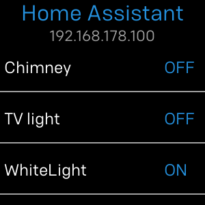

# Fitbit Homeassistant

[](https://gallery.fitbit.com/details/158edb1c-f748-4dbf-a682-b9dae2b74457)


[](https://github.com/smirko-dev/fitbit-homeassistant/blob/main/CHANGELOG.md)
[](https://github.com/smirko-dev/fitbit-homeassistant/blob/main/LICENSE)
[](https://github.com/smirko-dev/fitbit-homeassistant/actions)
[](https://github.com/smirko-dev/fitbit-homeassistant/actions)
[](https://github.com/smirko-dev/fitbit-homeassistant/releases)
## Description

This app allows to control [Home Assistant](https://www.home-assistant.io/) entities from a [Fitbit watch](https://www.fitbit.com/global/eu/home) via the [HomeAssistantAPI module](companion/) .

Supported languages: de-DE, en-US, it-IT.

Supported entity types:
<table>
<thead>
  <tr>
    <th>Action</th>
    <th>Entities</th>
  </tr>
</thead>
<tbody>
  <tr>
    <td>on / off</td>
    <td>switch, light, group</td>
  </tr>
  <tr>
    <td>open / close</td>
    <td>cover</td>
  </tr>
  <tr>
    <td>execute</td>
    <td>automation, script, button</td>
  </tr>
</tbody>
</table>

App icon is from https://icon-icons.com/de/symbol/home-assistant/138491 ([Apache License, Version 2.0](https://www.apache.org/licenses/LICENSE-2.0)).

### Requirements

- Home Assistant needs to be accessible via HTTPS or local network (via **IP address**) due to [Fetch API limitations](https://dev.fitbit.com/build/reference/companion-api/fetch/).
- The [RESTful API](https://www.home-assistant.io/integrations/api/) needs to be enabled in Home Assistant.
- A Home Assistant Long-Lived Access Token, described in [Authentication](https://www.home-assistant.io/docs/authentication/).

### Settings

- Home Assistant URL (text)
- Port number (text)
- Long-Lived Access Token (text)
- List of up to 10 entities (text)
- Force status (toggle)

*Entities should be added by ID and not by name!*

*Force status schould be used in case of HA responds with an empty JSON object on POST messages!*

## Screenshots



## How to build

Clone the repository

```
git clone git@github.com:smirko-dev/fitbit-homeassistant.git
cd fitbit-homeassistant
```

Choose SDK version

| SDK | Device                            |
|-----|-----------------------------------|
| 4   | Versa, Versa Lite, Versa 2, Ionic |
| 6   | Versa 3, Sense                    |

```
cp package.sdkX.json package.json
```

Setup SDK and build the application

```
npm add --also=dev @fitbit/sdk
npm add --also=dev @fitbit/sdk-cli
npx fitbit-build generate-appid
npx fitbit-build
```

## Known issues

- Doesn't work with [Nabu Casa](https://www.nabucasa.com/)
