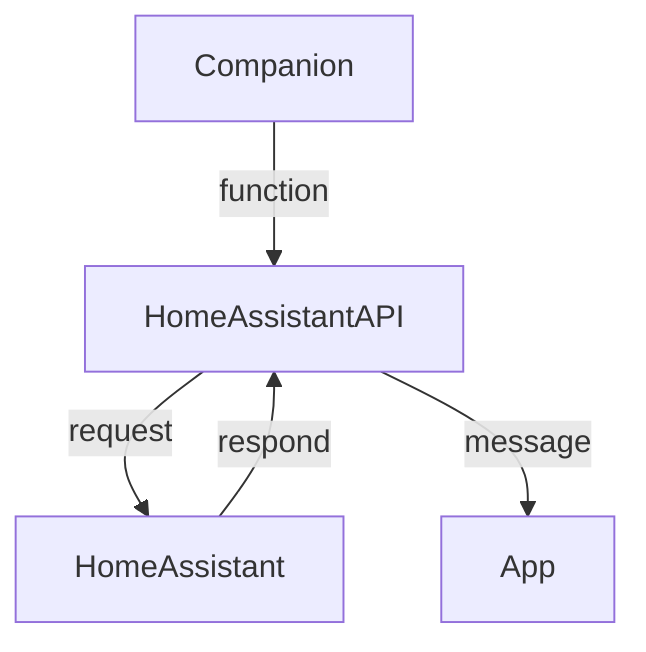

# HomeAssistantAPI

The [HomeAssistantAPI](HomeAssistantAPI.js) encapsulates the communication to the HomeAssistant instance.

## Setup

<table>
  <ti>
    <td>Function</td>
    <td>Description</td>
  </ti>
  <tr>
    <td><code>setup(url, port, token, force)</code></td>
    <td>Setup HomeAssistant configuration</td>
  </tr>
  <tr>
    <td><code>isValid()</code></td>
    <td>Return if HomeAssistantAPI has a valid configuration</td>
  </tr>
  <tr>
    <td><code>changeUrl(url)</code></td>
    <td>Change URL</td>
  </tr>
  <tr>
    <td><code>changePort(port)</code></td>
    <td>Change port number</td>
  </tr>
  <tr>
    <td><code>changeToken(token)</code></td>
    <td>Change access token</td>
  </tr>
  <tr>
    <td><code>changeForce(force)</code></td>
    <td>Change force update flag</td>
  </tr>
</table>

## Communication

It uses the [Fetch API](https://dev.fitbit.com/build/reference/companion-api/fetch/).
The asynchronous answer will be packed as JSON in a socket message.

<table>
  <ti>
    <td>Function</td>
    <td>Response</td>
  </ti>
  <tr>
    <td><code>fetchApiStatus()</code></td>
    <td>
Ok: <code>
{
  "key": "api",
  "value": "ok",
  "name": "<i>location_name</i>"
}
</code>
<br />
Error: <code>
{
  "key": "api",
  "value": "<i>error_message</i>"
}
</code>
    </td>
  </tr>
  <tr>
    <td><code>changeEntity(entity, state)</code></td>
    <td>
<code>
{
  "key": "change",
  "id": "<i>entity_id</i>"
  "state": "<i>entity_state</i>"
}
</code>
    </td>
  </tr>
  <tr>
    <td><code>fetchEntity(entity)</code></td>
    <td>
<code>
{
  "key": "add",
  "id": "<i>entity_id</i>",
  "name": "<i>entity_name</i>"
  "state": "<i>entity_state</i>"
}
</code>
    </td>
  </tr>
</table>



## Example

Companion
```js
import { HomeAssistantAPI } from "./HomeAssistantAPI";

var HA = new HomeAssistantAPI();
HA.setup("127.0.0.1", "8123", "my_secret_access_token", false);
HA.fetchApiStatus();
HA.fetchEntity("switch.myswitch");
```

App
```js
import * as messaging from "messaging";

messaging.peerSocket.onmessage = (evt) => {
    if (evt.data.key === "api") {
      if (evt.data.value === "ok") {
          console.log("HomeAssistant available");
      }
      else {
          console.log("HomeAssistant not available");
          console.log(`Error: ${evt.data.value}`);
      }
    }
    else if (evt.data.key === "add") {
       console.log(`New entry: ${evt.data.name} = ${evt.data.state}`);
    }
}
```
